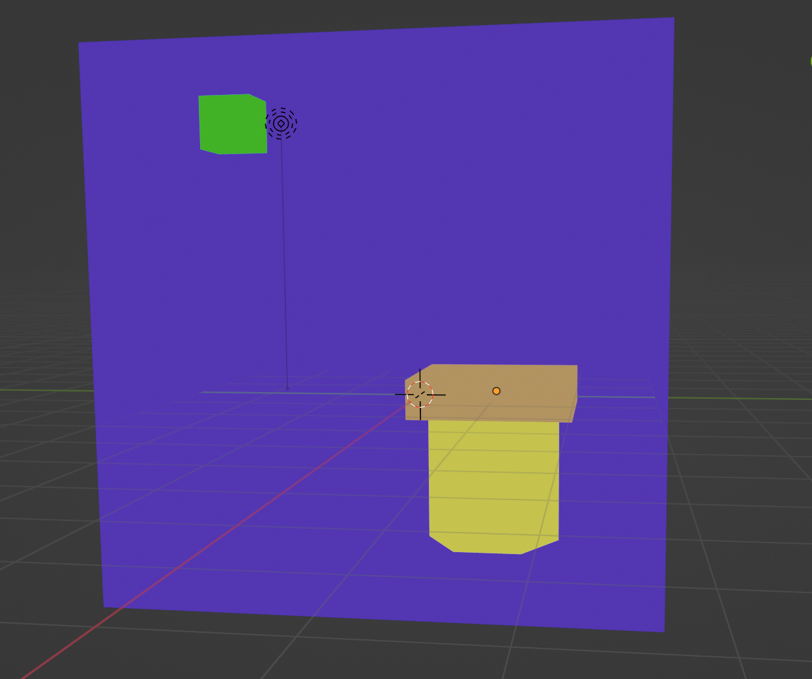
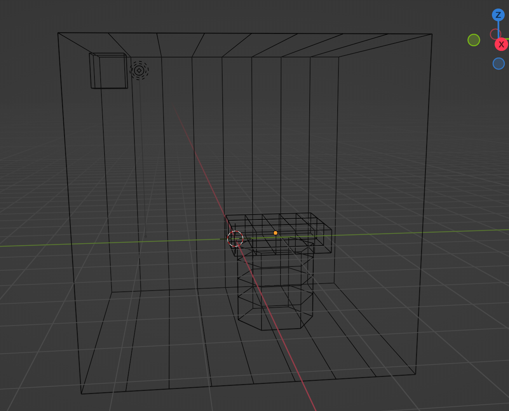

# CCI-36-lab-2

Relatório da atividade laborátorio 2 da disciplina de CCI-36 sobre Radiosidade.

Alunos: Fernando Zanchitta, Davi Xie, Mateus Nobre.

## Parte 1: Montagem da Cena

Durante a parte 1 foi realizada a montagem de uma cena no *Blender 3.2.1* de forma a testar o algoritmo de radiosidade. Seguimos as etapas para criação da cena, com a criação da caixa aberta, do cilindro de suporte, a tampa de mesa e o cubo no canto superior com propósito de emitir luz para as outras faces.

Foi gerado a seguinte cena:

Após a criação da cena, exportamos o projeto nos formatos: *.dae* e  *gltf*. Todos os arquivos gerados se encontram na pasta */myScene*.

Observação: Para realizar todos as contas e extração correta dos triângulos e vértices, o grupo optou por utilizar os arquivos gerados pelo professor. O principal motivo dessa decisão foi para diminuir a quantidade de triângulos a serem iterados nas contas uma vez que para chega-se em um algoritmo de complexidade alta.

## Parte 2: Extrair as informações dos arquivos 

Ao abrir o arquivo exportado em formato *.dae* pudemos extrair os dados relevantes para os cálculos da Parte 3, dentre eles: as coordenadas dos vértices, as cores dos vértices ( seguindo o padrão *R,G,B,A*). 

Foi criado arquivos auxiliares para tal, presentes nas pastas "tojson", "cleanedjson" e "face". Inicialmente, converteu-se o arquivo collada para um arquivo json. Após isso, extraiu-se as informações das coordenadas dos vértices, as normais dos vértices, as coordenadas de textura, as cores e as faces da figura, salvando estas informações em arquivos json na pasta "tojson". Depois, foi realizado uma refatorada em cada arquivo para melhor visualização e consumação desses dados. Finalmente, na pasta face, trabalhou-se no arquivo final contendo todas as informações de cada face, os seus vértices, sua normal, sua área e seu centróide, além das cores de cada vértice.

## Parte 3 Computar Radiosidade:

Para viés de simplificação do problema, foi considerado um problema análogo cujo objetivo é medir a incidência de um feixe de luz de uma fonte pontual sob as faces das figuras da cena. Para que essa conta seja feita a partir dos dados extraidos o Collada foram feitos os seguintes cálculos: a normal ,a área,e o centroide de cada face.

A normal da face foi calculada a partir dos vetores gerados pelos vértices, de forma que <N,V_i> = 0. As áreas das faces foram calculadas a partir do determinante das coordenadas dos vértices. E o Centróide foi gerado encontrando a média geométrica das coordenadas.

Após essa etapa, definimos a emissividade de um ponto de um objeto como 1. Devemos calcular as coordenadas globais desse ponto, para isso, devemos aplicar suas coordenadas a matrix de transformação, gerando assim, um ponto nas dimensões globais.

Foram encontrados problemas nas etapas seguintes, o algoritmo de cálculo de radiosidade conseguiu reduzir sua complexidade computacional, antes O(n4 ): deviamos calcular o fator de forma para cada conjunto de duas faces, além de fazer a verificação se não há interceptações de outras faces na frente do feixe de luz. 

Ao reduzir a fonte luminosa para um único corpo pontual pode-se diminuir o custo de complexidade do algoritmo para O(n3) entretanto não foi possível calcular essa etapa em tempo hábil de espera, devido a estrutura da cena e o problema em questão.

No arquivo face/face.json pode-se encontrar o arquivo json final utilizado no trabalho com todas as faces, detalhando todos os vértices, suas cores, textura, área, centróide, normal e coeficiente de reflexão para cada canal de cor.
